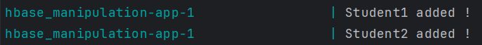

# Manipulation d'une table hbase avec l'API java

## Objectif

L'objectif de ce travail est de créer une application Java qui interagit avec une table HBase pour effectuer des opérations CRUD (Create, Read, Update, Delete). Alors, on gére une table Students pour une application de gestion scolaire. Cette table est destinée à stocker des informations sur les étudiants.

## Structure du projet

```
   src
    ├───main
    │   ├───java
    │   │   └───com
    │   │       └───errami
    │   │           └───App
    │   │
    │   └───resources
    └───test
        └───java
```

## Travail à faire

1. Créer la table students avec les familles de colonnes suivantes :
- info : pour stocker les informations personnelles des étudiants.
- grades : pour stocker les notes des étudiants.
2. Ajoutez les deux étudiants suivants :
- Étudiant 1: Row Key: "student1", info:name -> "John Doe", info:age -> "20", grades:math -> "B", grades:science -> "A"          
- Étudiant 2: Row Key: "student2", info:name -> "Jane Smith", info:age -> "22", grades:math -> "A", grades:science -> "A"
3. Récupérez et affichez  toutes les informations disponibles pour "student1".
4. Changez l'âge de "Jane Smith" à "23" et mettez à jour sa note de math à "A+".
5. Supprimez l'étudiant avec la Row Key "student1" de la table Students.
6. Affichez toutes les informations pour tous les étudiants.

## La tâche 1

1. Code source :

```java
public class App {
    public static final String TABLE_NAME = "Students";
    public static final String CF_INFO = "info";
    public static final String CF_GRADES = "grades";
    // ...
    public static void main(String[] args) {
        // ...
        
        TableName tableName = TableName.valueOf(TABLE_NAME);
        TableDescriptorBuilder tableDescriptorBuilder = TableDescriptorBuilder.newBuilder(tableName);
        tableDescriptorBuilder.setColumnFamily(ColumnFamilyDescriptorBuilder.of(CF_INFO));
        tableDescriptorBuilder.setColumnFamily(ColumnFamilyDescriptorBuilder.of(CF_GRADES));

        TableDescriptor tableDescriptor = tableDescriptorBuilder.build();

        if (!admin.tableExists(tableName)) {
            admin.createTable(tableDescriptor);
            System.out.println("Table created !");
        } else {
            System.err.println("Table already exists !");
        }

        // ...
    }
}
```

2. Résultat :


## La tâche 2

1. Code source :

```java
public class App {
    // ...
    
    public static void main(String[] args) {
        // ...
        
        // Add student1
        Put putStudent1 = new Put(Bytes.toBytes("student1"));
        putStudent1.addColumn(Bytes.toBytes(CF_INFO), Bytes.toBytes("name"), Bytes.toBytes("John Doe"));
        putStudent1.addColumn(Bytes.toBytes(CF_INFO), Bytes.toBytes("age"), Bytes.toBytes("20"));
        putStudent1.addColumn(Bytes.toBytes(CF_GRADES), Bytes.toBytes("math"), Bytes.toBytes("B"));
        putStudent1.addColumn(Bytes.toBytes(CF_GRADES), Bytes.toBytes("science"), Bytes.toBytes("A"));
        table.put(putStudent1);
        System.out.println("Student1 added !");

        // Add student2
        Put putStudent2 = new Put(Bytes.toBytes("student2"));
        putStudent2.addColumn(Bytes.toBytes(CF_INFO), Bytes.toBytes("name"), Bytes.toBytes("Jane Smith"));
        putStudent2.addColumn(Bytes.toBytes(CF_INFO), Bytes.toBytes("age"), Bytes.toBytes("22"));
        putStudent2.addColumn(Bytes.toBytes(CF_GRADES), Bytes.toBytes("math"), Bytes.toBytes("A"));
        putStudent2.addColumn(Bytes.toBytes(CF_GRADES), Bytes.toBytes("science"), Bytes.toBytes("A"));
        table.put(putStudent2);
        System.out.println("Student2 added !");
        
        // ...
    }
}
```
2. Résultat :



## La tâche 3

1. Code source :

```java
public class App {
    // ...
    
    public static void main(String[] args) {
        // ...

        // Retrieve and display information for student1
        Get getStudent1 = new Get(Bytes.toBytes("student1"));
        Result resultStudent1 = table.get(getStudent1);
        display(resultStudent1);
        
        // ...
    }
}
```
2. Résultat :


## La tâche 4

1. Code source :

```java
public class App {
    // ...
    
    public static void main(String[] args) {
        // ...

        // Update age of Jane Smith to 23 and math grade to A+
        Put putUpdateJane = new Put(Bytes.toBytes("student2"));
        putUpdateJane.addColumn(Bytes.toBytes(CF_INFO), Bytes.toBytes("age"), Bytes.toBytes("23"));
        putUpdateJane.addColumn(Bytes.toBytes(CF_GRADES), Bytes.toBytes("math"), Bytes.toBytes("A+"));
        table.put(putUpdateJane);
        System.out.println("Jane's age and math grade updated !");
        
        // ...
    }
}
```
2. Résultat :


## La tâche 5

1. Code source :

```java
public class App {
    // ...
    
    public static void main(String[] args) {
        // ...

        // Delete student1
        Delete deleteStudent1 = new Delete(Bytes.toBytes("student1"));
        table.delete(deleteStudent1);
        System.out.println("Student1 deleted !");
        
        // ...
    }
}
```
2. Résultat :


## La tâche 6

1. Code source :

```java
public class App {
    // ...
    
    public static void main(String[] args) {
        // ...

        // Display information for all students
        Scan scan = new Scan();
        ResultScanner scanner = table.getScanner(scan);
        for (Result result : scanner) {
            display(result);
        }
        
        // ...
    }
}
```
2. Résultat :

